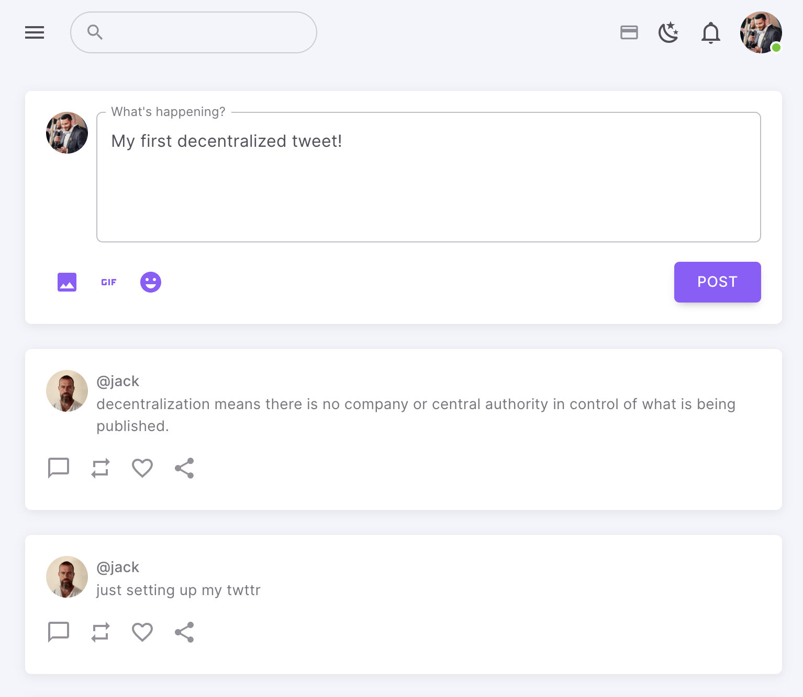

# BlogChain (Beta) Decentralized Micro-Blogging

[](https://prettier.io) [](http://commitizen.github.io/cz-cli/) [](https://opensource.org/licenses/MIT)

If something doesn’t work, please [file an issue](https://github.com/nicolqs/BlogChain/issues/new).<br>

# Repository Overview

Welcome to the GitHub repository for BlogChain, an innovative microblogging service built upon the Ethereum blockchain. This project is combining the world of social media with blockchain technology to create a decentralized platform for free expression and communication.

### What is BlogChain?

This App emulates the core features of traditional microblogging services like Twitter, but operates entirely on the Ethereum blockchain. By leveraging blockchain technology, this service ensures security, transparency, and independence from centralized control.



### Technology and Tools

- Next.js
- React + Typescript
- Material UI
- ethers.js
- [Hardhat](https://hardhat.org/)
- [Turborepo](https://turbo.build/repo/docs) build system optimized for TypeScript codebases

## Get started

```sh
yarn install
```

## Local blockchain

```sh
$ cd packages/solidity-contracts
$ npx hardhat node --fork https://mainnet.infura.io/v3/YOUR_INFURA_API_KEY
$ npx hardhat --network localhost run scripts/deploy.ts
```

## To run locally

```sh
yarn dev
```

Go to [http://localhost:3000/](http://localhost:3000/)

## Project Structure

```my-eth-app
├── README.md
├── contracts // smart contract solidity code
├── node_modules
├── package.json
├── public
├── apps // running apps or services (backend and frontend)
    ├── blogchain
        ├── src
            ├── components // React components
            └── configs
            └── pages // Next.js automated dynamic Routes
├── packages // packages used by our apps
    ├── packages
        ├── solidity-contracts
            ├── abis
            ├── contracts // smart contract ABI
├── styles
├── tsconfig.json
```
